# [回到导航页](../README.MD)
<br\>

# 什么是Zerotir
> Zerotir 是一个开源的虚拟组网工具，可以让你天涯海角的机器均处于同一局域网。
此时你可以优雅地使用各种局域网神器

# 配置步骤

## > 必要
> 这里必看，请依次往下操作

1. [>点我<](https://my.zerotier.com/) 打开Zerotir主页

2. 注册账号并登录
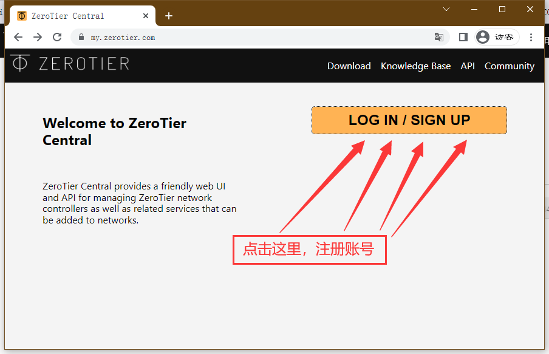

3. 登录后的页面点击【Create A Netword】按钮创建一个新的组网
4. 点击创建出的网络条目
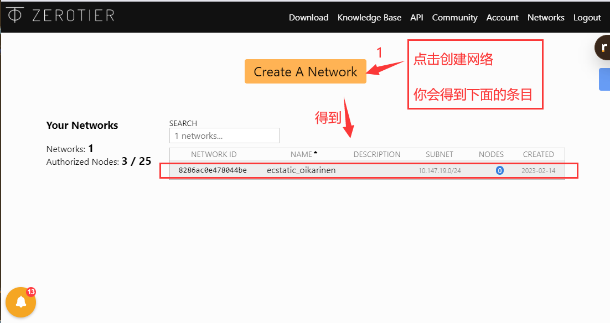

5. 给创建的组网改一个名字，选择组网ID右键复制
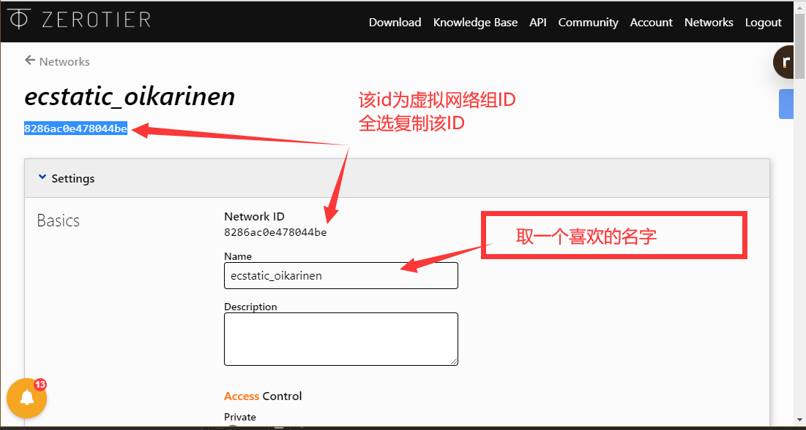

6. 按照自己的机器类型，给每个需要组网的电脑都下载对应的客户端安装
    > Windows：[>点我下载<](https://download.zerotier.com/dist/ZeroTier%20One.msi)
   > 
   > MacOS  :[>点我下载<](https://download.zerotier.com/dist/ZeroTier%20One.pkg)
   > 
   > iOS:[>点我下载<](https://apps.apple.com/us/app/zerotier-one/id1084101492)
   > 
   > 安卓:[>点我下载<](https://play.google.com/store/apps/details?id=com.zerotier.one)

7. 下载后安装软件，安装完成后右下角出现Zerotir 右键点击【Join New NetWork...】
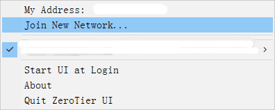

8. 在弹出的编辑框中粘贴(步骤5中)复制的ID，点击【Join】

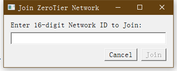

9. 在电脑右下角托盘找到Zerotir右键，点击刚才加入的网络

10. 勾选以下条目
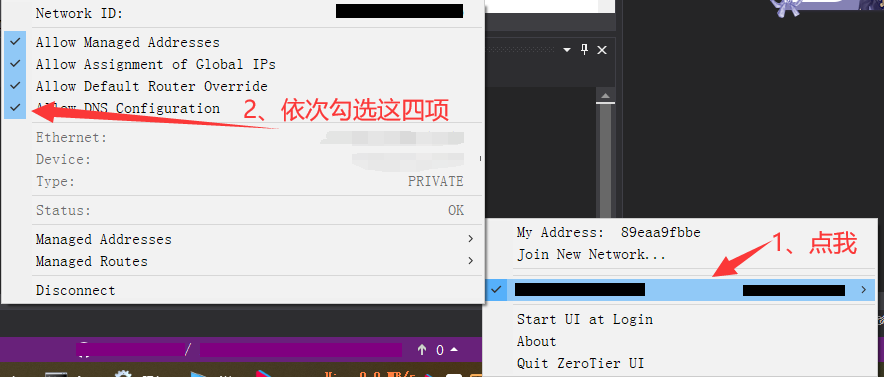

11. 重新回到Zerotir主页[[点我]](https://my.zerotier.com/)，选择之前的组网条目

12. 对组网内的的每个机器至少分配一个ip
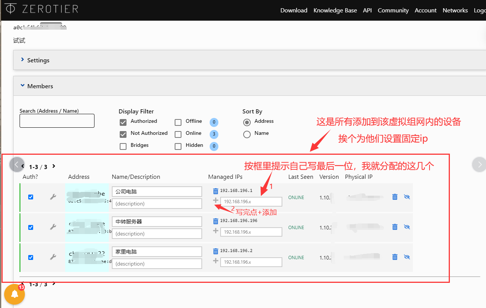

13. 在组网机器A 输入ipconfig 查看配置是否生效

14. ping 组网内另一台机器，测试内否直通
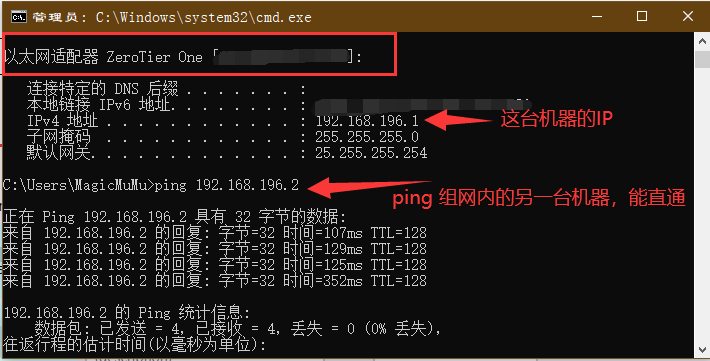

## 补充 
### 使用带公网ip的机器，配置 moon节点，用以转发降低延迟
> 上述已经完成组网，但由于服务器在国外，延迟较高。个人建议购买云服务器学生机进行转发很棒。

1.配置该公网机器的防火墙，开放9993端口。
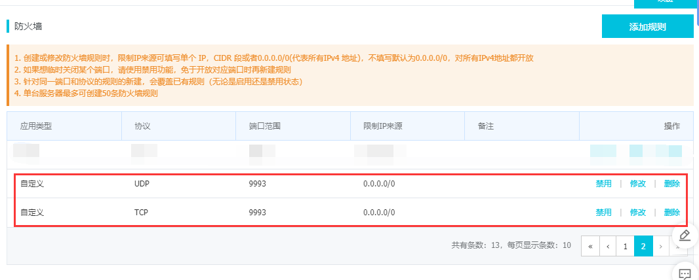

2.安装Zerotir 客户端
3.在作为中转的机器打开cmd,执行以下指令
   > cd C:\ProgramData\ZeroTier\One
   > 
   > zerotier-one_x64.exe -i initmoon identity.public >>moon.json
   > 

4.打开moon.json，把公网IP填进去如下
  > 记事本打开“stableEndpoints”: ["8.8.8.8/9993"] #8.8.8.8 改为你的公网IP
  > 
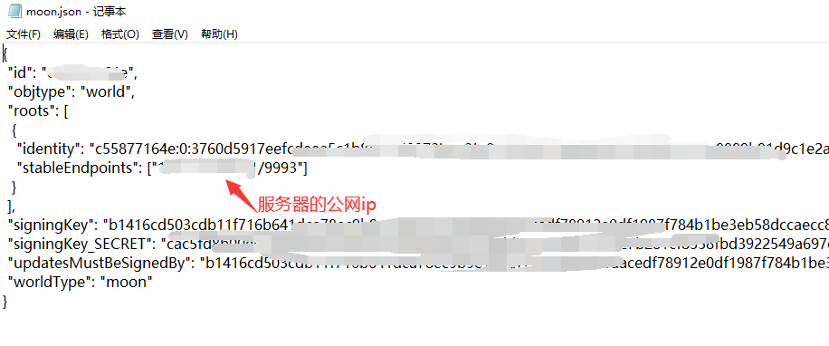
5.运行下面命令生成签名
   > cd C:\ProgramData\ZeroTier\One
   > 
  > zerotier-one_x64.exe -i genmoon moon.json
  
6.把MOON加入网络中
> 在C:\ProgramData\ZeroTier\One\目录下建立文件夹 moons.d 目录，将刚刚生成的 *.moon 文件拷贝进去。

7.重启Zerotir服务
> 按“WIN+R”键，打开运行窗口；2 输入”services.msc”，回车，运行的服务中找到ZeroTier one,选中点击右键，重启启动。

8.在其他组网机器LEAF节点，cmd执行以下命令#moon为Moon的ID值
   > cd C:\ProgramData\ZeroTier\One
   > 
> zerotier-one_x64.exe -q orbit 000000xxxxx 000000xxxxx 

9.检查加入moon节点是否成功，在机器执行以下命令，带moon字样节点即成功
   > cd C:\ProgramData\ZeroTier\One
   > 
> zerotier-one_x64.exe -q listpeers
   >
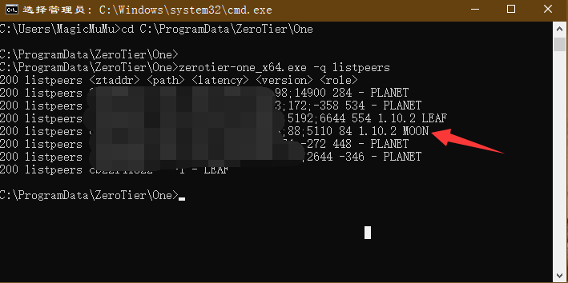

10.此时再次组网机器互ping，延迟降为100ms以内
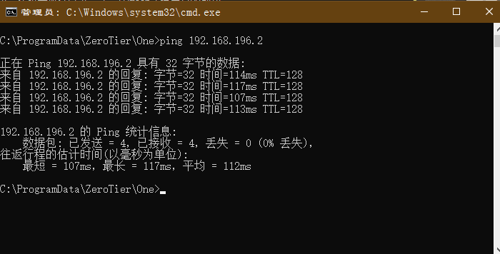
