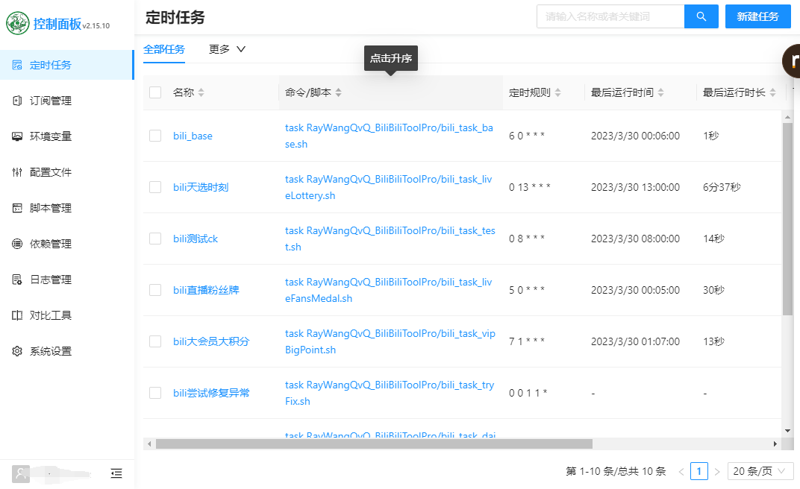
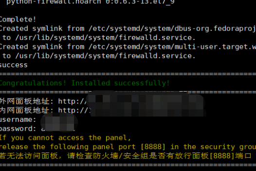
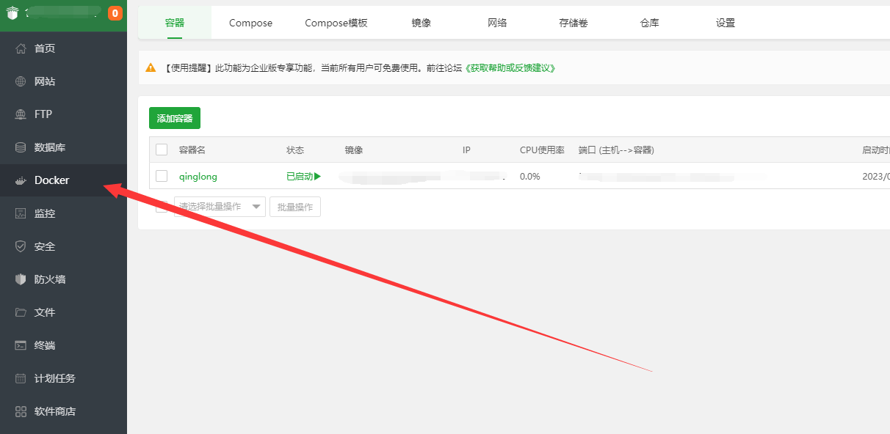
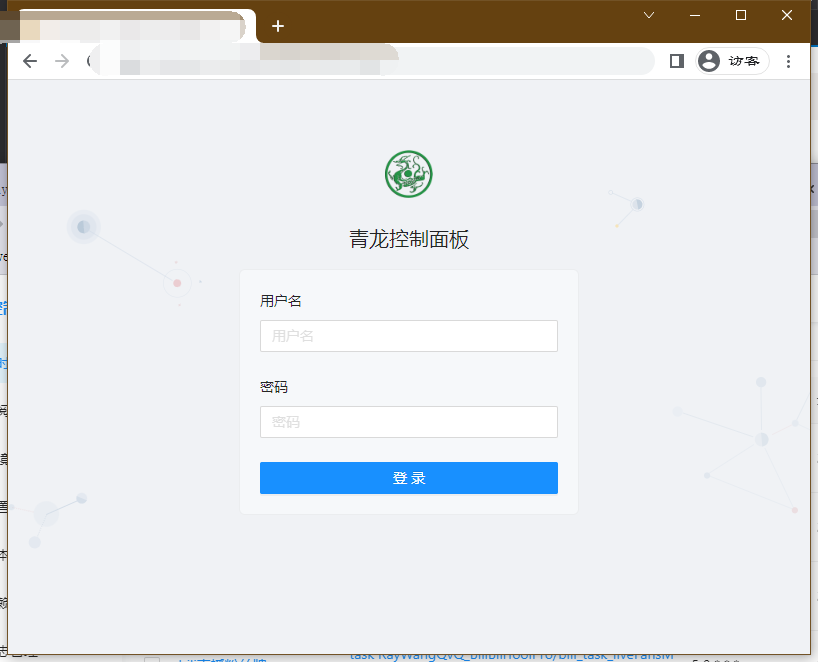
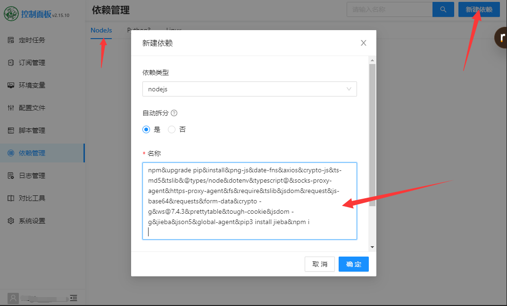
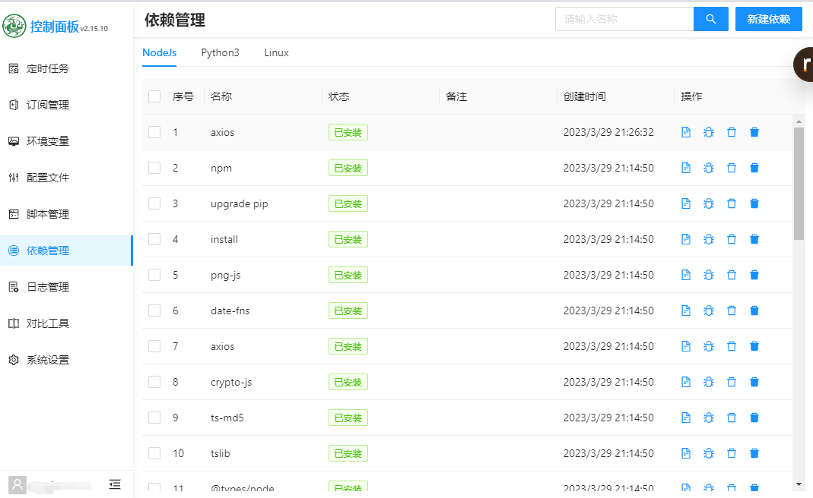

# [回到导航页](../README.MD)


## 什么是青龙面板
<div align="center">
支持python3、javaScript、shell、typescript 的定时任务管理面板
</div>



## 功能

- 支持多种脚本语言（python3、javaScript、shell、typescript）
- 支持在线管理脚本、环境变量、配置文件
- 支持在线查看任务日志
- 支持秒级任务设置
- 支持系统级通知
- 支持暗黑模式
- 支持手机端操作
## 配置步骤
1.安装宝塔面板

* 方法一：宝塔面板为运维，此步骤非必须:[宝塔面板安装](https://www.bt.cn/new/download.html)

* 方法二：运行下面的命令一键安装
```base
if [ -f /usr/bin/curl ];then curl -sSO https://download.bt.cn/install/install_panel.sh;else wget -O install_panel.sh https://download.bt.cn/install/install_panel.sh;fi;bash install_panel.sh ed8484bec
```
\
简单一路yes后，安装完成后如图\
\

\
2.安装docker
* 方法一：打开宝塔面板左侧docker按提示安装\


* 方法二：bash运行命令
```bash
sudo curl -sSL get.docker.com | sh
sudo curl -L https://github.com/docker/compose/releases/download/1.16.1/docker-compose-`uname -s`-`uname -m` -o /usr/local/bin/docker-compose
```

\
3.拉取青龙镜像
```bash
docker pull whyour/qinglong:latest
```

\
4.安装青龙镜像
```bash
docker run -dit \
  -v $PWD/ql/config:/ql/config \
  -v $PWD/ql/log:/ql/log \
  -v $PWD/ql/db:/ql/db \
  -v $PWD/ql/repo:/ql/repo \
  -v $PWD/ql/raw:/ql/raw \
  -v $PWD/ql/scripts:/ql/scripts \
  -v $PWD/ql/jbot:/ql/jbot \
  -v $PWD/ql/deps:/ql/deps \
  -v $PWD/ql/ninja:/ql/ninja \
  -p 5700:8894 \
  -p 5701:8895 \
  --name qinglong \
  --hostname qinglong \
  --restart unless-stopped \
  whyour/qinglong:latest

```

\
5.注册、登录青龙面板\
浏览器输入：[http://ip:8894](http://ip:8894)\


\
6.安装青龙外部依赖\
该命令比较久，可以先去泡杯茶上个厕所
```bash
docker exec -it qinglong bash
curl -fsSL https://ghproxy.com/https://raw.githubusercontent.com/shufflewzc/QLDependency/main/Shell/QLOneKeyDependency.sh | sh
exit
docker restart qinglong
```

\
7.安装青龙内部依赖\
登录青龙面板分别添加\

js依赖：
```bash
npm&upgrade pip&install&png-js&date-fns&axios&crypto-js&ts-md5&tslib&@types/node&dotenv&typescript@&socks-proxy-agent&https-proxy-agent&fs&require&tslib&jsdom&request&js-base64&requests&form-data&crypto -g&ws@7.4.3&prettytable&tough-cookie&jsdom -g&jieba&json5&global-agent&pip3 install jieba&npm i
```
Python3依赖：
```bash
typescript&requests&canvas&ping3&jieba&PyExecJS
```
\
一段时间后，即可安装完成


## 示例脚本
[哔哩哔哩日常签到等](https://github.com/RayWangQvQ/BiliBiliToolPro)